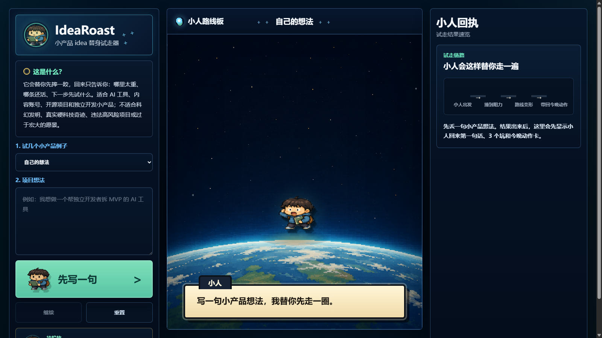

# IdeaRoast

IdeaRoast is a local-first pixel sandbox for stress-testing product ideas before you spend real build time on them.

You write one idea. A small "Little Walker" route tries to turn it into either:

- a direct build task that can go straight to Codex or another coding assistant, or
- a five-step reality walk that exposes unclear scope, hidden dependencies, risky assumptions, and the smallest useful next action.

## Status

This is a v0 prototype. It is useful as a local demo and product exploration artifact, but it is not a hosted service and does not promise business, legal, financial, or market advice.



## Works Without An API Key

IdeaRoast works without an API key.

- The local fallback is the default safe path.
- DeepSeek integration is optional.
- Bring your own API key if you want live model preview.
- The public demo never includes a hosted/shared API key.
- DeepSeek is not required and not the product identity.

The current DeepSeek files are optional provider adapter experiments. They are kept server-side and are documented in `docs/MODEL_PROVIDER_BOUNDARY.md`.

## Quick Start

From the project root:

```bash
npm start
```

Then open:

```text
http://127.0.0.1:4173/
```

You can also run the server directly:

```bash
node tools/local-static-server.mjs
```

No install step is required for the current static demo.

## Optional Model Preview

Use `.env.example` as a template if you want to test the optional DeepSeek adapter locally:

```env
DEEPSEEK_API_KEY=
DEEPSEEK_BASE_URL=https://api.deepseek.com
DEEPSEEK_SHADOW_MODEL=deepseek-v4-flash
```

Set these values in your local server environment, or load a private `.env` with your own tooling. Do not commit `.env`. The frontend must never receive a provider API key.

## Extending With Your Own Model

IdeaRoast is local-first. You can keep the browser UI unchanged and add your own server-side provider adapter.

Start from:

- `tools/local-static-server.mjs`
- `tools/ai-doorway-judge-runtime.mjs`
- `tools/little-walker-runtime.mjs`
- `data/little-walker-packet.schema.js`
- `tools/validate-little-walker-packet.mjs`

Provider keys must stay server-side. Do not expose API keys in `index.html`, `app.js`, browser storage, or committed files.

## What It Does

IdeaRoast is not a generic chatbot wrapper. Its product shape is a constrained idea-routing interface:

- `direct_build`: small webpages, local tools, scripts, or demos that are clear enough to build immediately.
- `try_walk`: product, workflow, AI-tool, platform, data, or distribution ideas that need a reality walk before building.
- `ask_one_question`: vague ideas that need one clarifying question.
- `hard_stop`: impossible, unsafe, or misleading ideas that should not receive an execution plan.

## Core Files

- `index.html`: app shell.
- `styles.css`: visual layer.
- `app.js`: browser interaction and local routing UI.
- `data/sample-simulation.js`: local mock packets and fallback behavior.
- `tools/local-static-server.mjs`: local static server and server-side API adapter boundary.
- `tools/ai-doorway-judge-runtime.mjs`: optional doorway model adapter runtime.
- `tools/deepseek-shadow-runtime.mjs`: optional shadow adapter runtime.
- `tools/little-walker-runtime.mjs`: optional Little Walker packet adapter runtime.

## Known Issues

- The model-generated route can still feel mechanical.
- The validator is conservative and may reject useful packets while the contract is still evolving.
- The UI is optimized for local observation, not yet for a polished public SaaS product.
- Optional provider preview is for local development only and should not be treated as the default product path.
